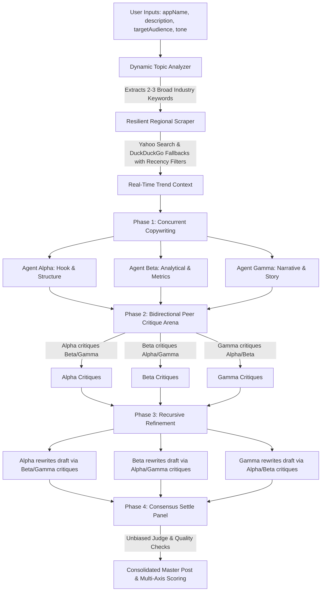

# Virality Mapper — Multi-Agent LinkedIn Debate Arena & Master Synthesizer 🚀

An advanced, premium multi-agent workspace designed to generate high-performing, viral LinkedIn posts. Instead of relying on single-pass AI prompts that yield generic, robotic copy, **Virality Mapper** runs a dynamic **3-Agent Copywriting Panel**, subjects their drafts to a **bidirectional peer review critique arena**, refines the content recursively, and synthesizes the ultimate post under the guidance of an **unbiased Master Synthesizer**—grounded in real-time, regional LinkedIn search trends.

---

## 🏗️ System Architecture & Debate Flow

The core of Virality Mapper is its multi-phase consensus and debate pipeline, which models a high-performance marketing brainstorming session:



### Phase 1: Topic Extraction, Recency Scraping & Initial Drafting
- **Dynamic Topic Analyzer**: Parses the user's project info (`appName`, `description`, `targetAudience`) using an LLM. It extracts 2-3 broader, high-volume industry keywords rather than relying on hyper-specific project names.
- **Resilient Trend Scraper**: Querying `site:linkedin.com` using the current year dynamically (`new Date().getFullYear()`), the scraper pulls snippets of live posts.
  - **Recency Filters**: Targets fresh content using strict filters (`age=1m` on Yahoo Search, `df=m` on DuckDuckGo Lite & DuckDuckGo HTML) to guarantee search results match the current trend landscape.
  - **Fallback Chain**: Queries Yahoo Search as the primary provider (highly stable), falling back to DuckDuckGo Lite, and then standard DuckDuckGo HTML search if blocked or timed out.
- **Concurrent Copywriting**: The live search context is injected into the copywriting environment. Three specialist agents generate their initial drafts sequentially:
  - **Agent Alpha (Hook & Structure)**: Specializes in scroll-stopping pattern-interrupt hooks, crisp visual breaks, and maximized click-through rate (CTR).
  - **Agent Beta (Analytical & Metrics)**: Focuses on checklists, bold numbers, clear business metrics, and raw educational value.
  - **Agent Gamma (Narrative & Story)**: Employs the hero's journey, lessons learned, and brand vulnerability.

### Phase 2: Bidirectional Peer Critique Arena
Rather than selecting a draft immediately, the three agents enter a bidirectional critique loop where each agent acts as a reviewer for both of their peers:
- **Agent Alpha** reviews and critiques **Agent Beta** and **Agent Gamma**.
- **Agent Beta** reviews and critiques **Agent Alpha** and **Agent Gamma**.
- **Agent Gamma** reviews and critiques **Agent Alpha** and **Agent Beta**.

Each peer critique rates the copy out of 100 and outlines structural, metric-based, or storytelling recommendations.

### Phase 3: Recursive Refinement Cycle
Each agent receives their specific critiques and refines their original post to implement suggested updates, returning the updated post along with a change log argument explaining their edits.

### Phase 4: Consensus Settle Panel (Master Synthesizer)
The 3 refined drafts, their critique histories, and self-change arguments are consolidated in a final consensus call:
- **Unbiased Judge**: A dedicated judge agent merges the absolute best parts of the drafts (e.g. Agent Alpha's hook, Agent Beta's value list, Agent Gamma's storytelling arc).
- **Strict Quality Checks**: Enforces copywriting guidelines (under 1200 chars, no abstract fluff like "game-changing" or "digital abyss", exact binary question ending, bridging sentences before metrics, cohesive single metaphors).
- **Multi-Axis Performance Score**: Automatically computes individual ratings for **Hook Strength**, **Readability**, **Credibility**, and **Viral Potential** which are dynamically rendered in the UI.

---

## ✨ Key Features

- **Live Search Grounding**: Automatically extracts real-time professional hooks and trending structures from LinkedIn posts via a multi-engine scraper pipeline (Yahoo Search primary, DuckDuckGo Lite & HTML fallbacks) with strict monthly recency filters implemented in [app/api/generate/route.ts](file:///c:/Users/dasan/Documents/GitHub/Virality-Mapper/app/api/generate/route.ts).
- **Multi-Axis Scoring System**: Receives 4-axis performance metrics (Hook Strength, Readability, Credibility, Viral Potential) for the final consolidated post, rendered through visual score meters in [ResultsDisplay.tsx](file:///c:/Users/dasan/Documents/GitHub/Virality-Mapper/components/ResultsDisplay.tsx).
- **Persistent Credentials & Configurations**: All LLM API keys (`vm_api_keys`) and custom agent settings (`vm_agents_config`) are saved locally in the browser's `localStorage` via [SettingsTab.tsx](file:///c:/Users/dasan/Documents/GitHub/Virality-Mapper/components/SettingsTab.tsx) and [page.tsx](file:///c:/Users/dasan/Documents/GitHub/Virality-Mapper/app/page.tsx). No keys are reset or wiped on page refresh, and no credentials ever touch a database.
- **Configurable LLM Timeouts**: Adjust standard API timeouts (default 30 seconds) via the `LLM_TIMEOUT_MS` constant in [app/api/generate/route.ts](file:///c:/Users/dasan/Documents/GitHub/Virality-Mapper/app/api/generate/route.ts#L321).
- **Interactive Archive Viewer**: Save generation runs to local storage, review previous runs, navigate critique logs, and inspect agent score sheets in a split-pane interface in [PostGeneratorForm.tsx](file:///c:/Users/dasan/Documents/GitHub/Virality-Mapper/components/PostGeneratorForm.tsx).
- **Stable Tab State Memory**: Navigating between Workspace, Settings, and Agents tabs keeps the current generation state, active stream readers, and typewriter animations running smoothly in the background without unmounting.
- **Monospace Console & Stopwatch Logs**: Real-time logs panel showing crawler actions, model requests, and backoff retries, alongside a live Stopwatch tracking generation duration.
- **Flexible Provider Integrations**: Out-of-the-box support for Google Gemini, OpenAI, Anthropic, OpenRouter, local models (Ollama, LM Studio), and custom API proxies.
- **Premium UI/UX Design**: Modern, glassmorphic dark-theme design featuring premium typography (Google Fonts Inter/Outfit), subtle hover effects, responsive layout grids, and smooth scrolling powered by `lenis` and [LenisProvider.tsx](file:///c:/Users/dasan/Documents/GitHub/Virality-Mapper/components/LenisProvider.tsx).

---

## 🛠️ Tech Stack

- **Frontend**: Next.js (App Router) in [app/page.tsx](file:///c:/Users/dasan/Documents/GitHub/Virality-Mapper/app/page.tsx), React 19, Lucide Icons, Framer Motion, Lenis (Fluid Smooth Scroll), Vanilla CSS (Geist typographic styling in [app/globals.css](file:///c:/Users/dasan/Documents/GitHub/Virality-Mapper/app/globals.css))
- **Backend/API**: Next.js API Routes (Server-Sent Events streaming) in [app/api/generate/route.ts](file:///c:/Users/dasan/Documents/GitHub/Virality-Mapper/app/api/generate/route.ts), dynamic LLM proxies (`@google/genai`, `@anthropic-ai/sdk`, `openai`)

---

## 💻 Getting Started

### Prerequisites
- Node.js (v18 or higher)
- npm

### Installation & Run

1. **Clone the repository and install dependencies**:
   ```bash
   cd Virality-Mapper
   npm install
   ```

2. **Run the development server**:
   ```bash
   npm run dev
   ```

3. **Open the workspace**:
   Navigate to [http://localhost:3000](http://localhost:3000) in your browser.

---

## 🧠 Workspace Guide

1. **Setup Credentials**: Go to the **Settings** tab and enter your LLM API keys. Use the **Test Connection** button to query available models from each provider and verify connection stability.
2. **Configure Copywriters**: Use the **Agent Playground** tab to fine-tune copywriter temperatures, change models, or update core copywriter system prompts.
3. **Execute the Arena**: In the **Workspace** tab, fill out your project details (name, description, target audience, tone) and click **Run 3-Agent Debate Arena**.
4. **Inspect & Tweak**: Track the live logs and watch the workspace compile initial drafts, peer review cards, refined drafts, and the final synthesized copy. Copy the consolidated copy-ready master post directly from the workspace!
