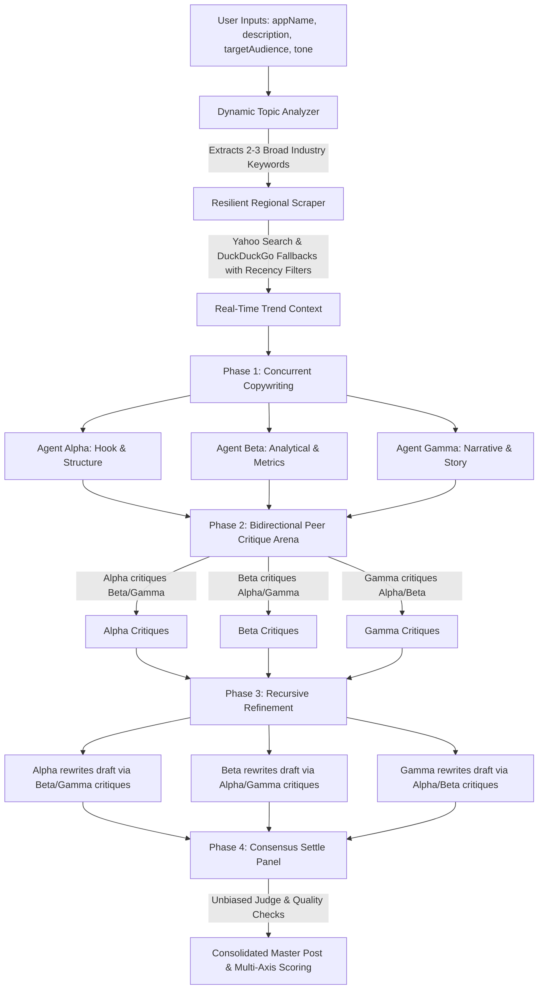

# Virality Mapper — Multi-Agent LinkedIn Debate Arena & Master Synthesizer 🚀

An advanced, premium multi-agent workspace designed to generate high-performing, viral LinkedIn posts. Instead of relying on single-pass AI prompts that yield generic, robotic copy, **Virality Mapper** runs a dynamic **3-Agent Copywriting Panel**, subjects their drafts to a **bidirectional peer review critique arena**, refines the content recursively, and synthesizes the ultimate post under the guidance of an **unbiased Master Synthesizer**—grounded in real-time LinkedIn search trends.

The application is structured as a two-stage routing architecture:
1. **`/` (Landing Page)**: An award-worthy, minimalist, and typographic showcase featuring interactive A/B visualizers, stepper pipelines, and layout transitions.
2. **`/workspace` (Workspace Studio)**: The full client-side copywriting studio housing editor panels, history search logs, agent temperature controllers, and settings.

---

## 🏗️ System Architecture & Debate Flow

The core of Virality Mapper is its multi-phase consensus and debate pipeline, which models a high-performance marketing brainstorming session:



### Phase 1: Topic Extraction, Recency Scraping & Initial Drafting
- **Dynamic Topic Analyzer**: Parses the user's project info (`appName`, `description`, `targetAudience`) using an LLM. It extracts 2-3 broader, high-volume industry keywords rather than relying on hyper-specific project names.
- **Resilient Trend Scraper**: Querying `site:linkedin.com` using the current year dynamically, the scraper pulls snippets of live posts.
  - **Recency Filters**: Targets fresh content using strict filters (`age=1m` on Yahoo Search, `df=m` on DuckDuckGo Lite & DuckDuckGo HTML) to guarantee search results match the current trend landscape.
  - **Fallback Chain**: Queries Yahoo Search as the primary provider (highly stable), falling back to DuckDuckGo Lite, and then standard DuckDuckGo HTML search if blocked or timed out.
- **Concurrent Copywriting**: The live search context is injected into the copywriting environment. Three specialist agents generate their initial drafts sequentially:
  - **Agent Alpha (Hook & Structure)**: Specializes in scroll-stopping pattern-interrupt hooks, crisp visual breaks, and maximized click-through rate (CTR).
  - **Agent Beta (Analytical & Metrics)**: Focuses on checklists, bold numbers, clear business metrics, and raw educational value.
  - **Agent Gamma (Narrative & Story)**: Employs the hero's journey, lessons learned, and brand vulnerability.

### Phase 2: Bidirectional Peer Critique Arena
Rather than selecting a draft immediately, the three agents enter a bidirectional critique loop where each agent acts as a reviewer for both of their peers:
- **Agent Alpha** reviews and critiques **Agent Beta** and **Agent Gamma**.
- **Agent Beta** reviews and critiques **Agent Alpha** and **Agent Gamma**.
- **Agent Gamma** reviews and critiques **Agent Alpha** and **Agent Beta**.

Each peer critique rates the copy out of 100 and outlines structural, metric-based, or storytelling recommendations.

### Phase 3: Recursive Refinement Cycle
Each agent receives their specific critiques and refines their original post to implement suggested updates, returning the updated post along with a change log argument explaining their edits.

### Phase 4: Consensus Settle Panel & A/B Testing Simulator
The 3 refined drafts, their critique histories, and self-change arguments are consolidated in a final consensus and validation pipeline:
- **Unbiased Judge**: A dedicated judge agent merges the absolute best parts of the drafts (e.g. Agent Alpha's hook, Agent Beta's value list, Agent Gamma's storytelling arc).
- **Strict Quality Checks & Formatting Sanitizers**: Enforces copywriting guidelines (under 1200 chars, no abstract fluff like "game-changing") and strips mathematical bold/italic unicode characters back to standard alphanumeric representation. Auto-formats paragraph spacing to ensure a maximum of 2 sentences per text block for mobile feed dwell-time.
- **Multi-Axis Performance Score**: Automatically computes individual ratings for **Hook Strength**, **Readability** (estimated Flesch Reading Ease score), **Credibility**, and **Viral Potential** which are dynamically rendered in the UI.
- **AI Focus Group A/B Simulator**: Evaluates the synthesized post against 4 distinct target audience personas (*Skeptical CTO*, *Hustling Solopreneur*, *Metrics-Driven VC*, *Developer Advocate*). Each persona evaluates the draft, outputs scroll-stopping/comment/repost probability ratings, and provides qualitative feedback.

---

## ✨ Key Features

- **OpenWebUI-Style Customizable Settings Console**: Restructured into 8 tabs for complete workspace customization (API Connections, Model Registry, Hyperparameters, Critique Metrics, Focus Personas, Grounding Scrapers, UI Styling, Admin Console) via [components/SettingsModal.tsx](file:///Users/anv./Documents/Virality%20Mapper/components/SettingsModal.tsx).
- **Dynamic Model & Connections Registry**: Register custom endpoints (Ollama, LM Studio, custom base URLs, custom headers, and API keys) and map individual models. Registered models automatically populate in specialist agent dropdowns in [components/AgentPlayground.tsx](file:///Users/anv./Documents/Virality%20Mapper/components/AgentPlayground.tsx).
- **Advanced Hyperparameter Sliders**: Fine-tune global LLM parameters: Temperature (0.0 to 2.0), Top-P, Top-K, Presence and Frequency penalties, deterministic seed, and stop sequences.
- **Custom Critique Metrics & Dynamic Scoring**: Create, edit, and delete evaluation axes. Direct grading instructions are sent to LLM agents dynamically to audit drafts, and scores are rendered visually via progress indicators in [components/ResultsDisplay.tsx](file:///Users/anv./Documents/Virality%20Mapper/components/ResultsDisplay.tsx).
- **Simulated Focus Group Persona Customizer**: Define and edit audience simulators with custom bios, avatars, and commenting ratios to evaluate posts dynamically in the A/B focus group panel.
- **Visual Typography & Custom Web Fonts**: Choose between Geist, Inter, Outfit, Plus Jakarta Sans, Fira Code, or load any external Google Font dynamically using font stylesheet URLs and CSS family names.
- **Config backups & फैक्ट्री resets**: Export a full JSON config file, import configuration files with validation, or run a factory reset to wipe local browser cache.
- **Live & Organic Search Grounding**: Automatically extracts real-time professional hooks and trending structures from LinkedIn posts via a multi-engine scraper pipeline (Yahoo Search primary, DuckDuckGo Lite & HTML fallbacks) with monthly recency filters. If a **SerpApi key** is configured, queries Google Search organically with monthly filters (`tbs=qdr:m`) to bypass scrapers.
- **Neuromarketing Hook Archetypes**: Select dropdown to target specific copywriting angles: *Contrarian Interrupt* (shock & debunk), *Vulnerable Disclosure* (failure & trust), *High-Value Stash* (resources & curation), and *Threat & Fear* (operational risk).
- **Self-Improving RAG Analytics Loop**: Record actual views, likes, and comments for published posts in the Archive pane. The system automatically extracts these success stories and prepends them as top-priority few-shot reference templates for future generations.
- **Configurable LLM Timeouts**: Adjust standard API timeouts (default 30 seconds) via the `LLM_TIMEOUT_MS` constant in [app/api/generate/route.ts](file:///Users/anv./Documents/Virality%20Mapper/app/api/generate/route.ts).
- **Interactive Archive Viewer**: Save generation runs to local storage, review previous runs, navigate critique logs, and inspect agent score sheets in a split-pane interface in [components/PostGeneratorForm.tsx](file:///Users/anv./Documents/Virality%20Mapper/components/PostGeneratorForm.tsx).
- **Stable Tab State Memory**: Navigating between Workspace, Settings, and Agents tabs keeps the current generation state, active stream readers, and typewriter animations running smoothly in the background without unmounting.
- **Monospace Console & Stopwatch Logs**: Real-time logs panel showing crawler actions, model requests, and backoff retries, alongside a live Stopwatch tracking generation duration.
- **Flexible Provider Integrations**: Out-of-the-box support for Google Gemini, OpenAI, Anthropic, OpenRouter, local models (Ollama, LM Studio), and custom API proxies.
- **Premium UI/UX Design**: Modern, glassmorphic dark-theme design featuring premium typography (Google Fonts Inter/Outfit), subtle hover effects, responsive layout grids, and smooth scrolling powered by `lenis` and [components/LenisProvider.tsx](file:///Users/anv./Documents/Virality%20Mapper/components/LenisProvider.tsx).
- **Persistent Credentials & Configurations**: All configurations, API connections, agent templates, custom metrics, and history logs are serialized into a master `vm_master_config` state in `localStorage` in a backward-compatible format. No data is reset on refresh, and no credentials ever touch a database.

---

## 🛠️ Tech Stack

- **Frontend**: Next.js (App Router) in [app/workspace/page.tsx](file:///Users/anv./Documents/Virality%20Mapper/app/workspace/page.tsx), React 19, Lucide Icons, Framer Motion, Lenis (Fluid Smooth Scroll), Vanilla CSS (Geist typographic styling in [app/globals.css](file:///Users/anv./Documents/Virality%20Mapper/app/globals.css))
- **Backend/API**: Next.js API Routes (Server-Sent Events streaming) in [app/api/generate/route.ts](file:///Users/anv./Documents/Virality%20Mapper/app/api/generate/route.ts), dynamic LLM proxies (`@google/genai`, `@anthropic-ai/sdk`, `openai`)

---

## 💻 Getting Started

### Prerequisites
- Node.js (v18 or higher)
- npm

### Installation & Run

1. **Clone the repository and install dependencies**:
   ```bash
   cd Virality-Mapper
   npm install
   ```

2. **Run the development server**:
   ```bash
   npm run dev
   ```

3. **Open the workspace**:
   Navigate to [http://localhost:3000](http://localhost:3000) in your browser.

---

## 🧠 Workspace Guide

1. **Setup Connections & Model Registry**: Go to the settings drawer (`Settings` button) and configure your LLM provider keys. Under **Model Registry**, you can register local models (Ollama, LM Studio) or custom proxies. Registered models automatically populate in specialist agent dropdowns.
2. **Tune Hyperparameters & Metrics**: Set global parameters (temperature, topP, topK, presence/frequency penalties, seeds, stop sequences) under **Hyperparameters**. Create or edit dynamic critique metrics under **Critique Metrics** and target focus group simulators under **Focus Personas**.
3. **Configure specialist writers**: In the **Specialist Agents** tab, fine-tune the prompts, temperatures, and model choices for the three debate agents (Alpha, Beta, Gamma).
4. **Execute the debate arena**: In the **Workspace** tab, fill out your project details (name, description, target audience, tone), select a copywriting Hook Archetype (organic, contrarian, vulnerable, value-stash, threat-fear), and click **Run 3-Agent Copywriting Debate**.
5. **Inspect logs & settle output**: Watch live scrapers and LLM routing logs via the real-time HUD terminal. View drafts, critiques, and refinements sequentially. Copy the finalized consolidated post graded dynamically against your custom metrics axes, and preview the desktop LinkedIn feed or target focus group simulations.
6. **Export & backups**: Back up your configurations, models, critique criteria, and personas under the **Admin Console** tab using **Export JSON Backup**. Restore them on any device using **Import JSON Backup** or clear cache using **Factory Reset**.
