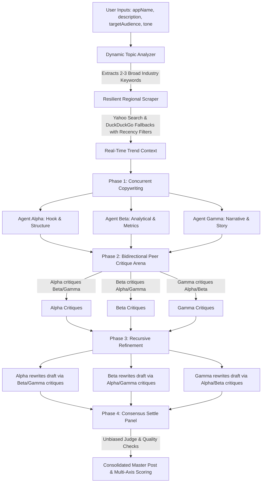

# Virality Mapper — Multi-Agent LinkedIn Debate Arena & Master Synthesizer 🚀

An advanced, premium multi-agent workspace designed to generate high-performing, viral LinkedIn posts. Instead of relying on single-pass AI prompts that yield generic, robotic copy, **Virality Mapper** runs a dynamic **3-Agent Copywriting Panel**, subjects their drafts to a **bidirectional peer review critique arena**, refines the content recursively, and synthesizes the ultimate post under the guidance of an **unbiased Master Synthesizer**—grounded in real-time LinkedIn search trends.

The application is structured as a two-stage routing architecture:
1. **`/` (Landing Page)**: An award-worthy, minimalist, and typographic showcase featuring interactive A/B visualizers, stepper pipelines, and layout transitions.
2. **`/workspace` (Workspace Studio)**: The full client-side copywriting studio housing editor panels, history search logs, agent temperature controllers, and settings.

---

## 🏗️ System Architecture & Debate Flow

The core of Virality Mapper is its multi-phase consensus and debate pipeline, which models a high-performance marketing brainstorming session:



### Phase 1: Topic Extraction, Recency Scraping & Initial Drafting
- **Dynamic Topic Analyzer**: Parses the user's project info (`appName`, `description`, `targetAudience`) using an LLM. It extracts 2-3 broader, high-volume industry keywords rather than relying on hyper-specific project names.
- **Resilient Trend Scraper**: Querying `site:linkedin.com` using the current year dynamically, the scraper pulls snippets of live posts.
  - **Recency Filters**: Targets fresh content using strict filters (`age=1m` on Yahoo Search, `df=m` on DuckDuckGo Lite & DuckDuckGo HTML) to guarantee search results match the current trend landscape.
  - **Fallback Chain**: Queries Yahoo Search as the primary provider (highly stable), falling back to DuckDuckGo Lite, and then standard DuckDuckGo HTML search if blocked or timed out.
- **Concurrent Copywriting**: The live search context is injected into the copywriting environment. Three specialist agents generate their initial drafts sequentially:
  - **Agent Alpha (Hook & Structure)**: Specializes in scroll-stopping pattern-interrupt hooks, crisp visual breaks, and maximized click-through rate (CTR).
  - **Agent Beta (Analytical & Metrics)**: Focuses on checklists, bold numbers, clear business metrics, and raw educational value.
  - **Agent Gamma (Narrative & Story)**: Employs the hero's journey, lessons learned, and brand vulnerability.

### Phase 2: Bidirectional Peer Critique Arena
Rather than selecting a draft immediately, the three agents enter a bidirectional critique loop where each agent acts as a reviewer for both of their peers:
- **Agent Alpha** reviews and critiques **Agent Beta** and **Agent Gamma**.
- **Agent Beta** reviews and critiques **Agent Alpha** and **Agent Gamma**.
- **Agent Gamma** reviews and critiques **Agent Alpha** and **Agent Beta**.

Each peer critique rates the copy out of 100 and outlines structural, metric-based, or storytelling recommendations.

### Phase 3: Recursive Refinement Cycle
Each agent receives their specific critiques and refines their original post to implement suggested updates, returning the updated post along with a change log argument explaining their edits.

### Phase 4: Consensus Settle Panel & A/B Testing Simulator
The 3 refined drafts, their critique histories, and self-change arguments are consolidated in a final consensus and validation pipeline:
- **Unbiased Judge**: A dedicated judge agent merges the absolute best parts of the drafts (e.g. Agent Alpha's hook, Agent Beta's value list, Agent Gamma's storytelling arc).
- **Strict Quality Checks & Formatting Sanitizers**: Enforces copywriting guidelines (under 1200 chars, no abstract fluff like "game-changing") and strips mathematical bold/italic unicode characters back to standard alphanumeric representation. Auto-formats paragraph spacing to ensure a maximum of 2 sentences per text block for mobile feed dwell-time.
- **Multi-Axis Performance Score**: Automatically computes individual ratings for **Hook Strength**, **Readability** (estimated Flesch Reading Ease score), **Credibility**, and **Viral Potential** which are dynamically rendered in the UI.
- **AI Focus Group A/B Simulator**: Evaluates the synthesized post against 4 distinct target audience personas (*Skeptical CTO*, *Hustling Solopreneur*, *Metrics-Driven VC*, *Developer Advocate*). Each persona evaluates the draft, outputs scroll-stopping/comment/repost probability ratings, and provides qualitative feedback.

---

## ✨ Key Features

### Core Generation Engine
- **OpenWebUI-Style Customizable Settings Console**: Restructured into 8 dedicated tabs for complete workspace customization (API Connections, Model Registry, Hyperparameters, Critique Metrics, Focus Personas, Grounding Scrapers, UI Styling, Admin Console) via [SettingsModal.tsx](file:///Users/anv./Documents/Virality%20Mapper/components/SettingsModal.tsx).
- **Dynamic Model & Connections Registry**: Register custom endpoints (Ollama, LM Studio, custom base URLs, custom headers, and API keys) and map individual models. Registered models automatically populate in specialist agent dropdowns in [AgentPlayground.tsx](file:///Users/anv./Documents/Virality%20Mapper/components/AgentPlayground.tsx).
- **Advanced Hyperparameter Sliders**: Fine-tune global LLM parameters: Temperature (0.0 to 2.0), Top-P, Top-K, Presence and Frequency penalties, deterministic seed, and stop sequences.
- **Custom Critique Metrics & Dynamic Scoring**: Create, edit, and delete evaluation axes. Direct grading instructions are sent to LLM agents dynamically to audit drafts, and scores are rendered visually via progress indicators in [ResultsDisplay.tsx](file:///Users/anv./Documents/Virality%20Mapper/components/ResultsDisplay.tsx).
- **Neuromarketing Hook Archetypes**: Select dropdown to target specific copywriting angles: *Contrarian Interrupt* (shock & debunk), *Vulnerable Disclosure* (failure & trust), *High-Value Stash* (resources & curation), and *Threat & Fear* (operational risk).
- **Live & Organic Search Grounding**: Automatically extracts real-time professional hooks and trending structures from LinkedIn posts via a multi-engine scraper pipeline (Yahoo Search primary, DuckDuckGo Lite & HTML fallbacks) with monthly recency filters. If a **SerpApi key** is configured, queries Google Search organically with monthly filters (`tbs=qdr:m`) to bypass scrapers.

### Workspace UI & Viewing Experience
- **Live Debate Timeline**: A vertical `Grounding → Drafting → Critiques → Refining → Synthesis` progress indicator ([DebateTimeline.tsx](file:///Users/anv./Documents/Virality%20Mapper/components/workspace/DebateTimeline.tsx)) tracks which pipeline phase is currently executing in real-time.
- **Critique Arena View**: Dedicated tabbed panel ([CritiqueArenaView.tsx](file:///Users/anv./Documents/Virality%20Mapper/components/workspace/CritiqueArenaView.tsx)) with sub-tabs for *01 / Initial Drafts*, *02 / Critiques*, and *03 / Refined Drafts*—each with copy-to-clipboard controls and per-agent hook strategy explanations and change arguments.
- **LinkedIn Feed Preview Toggle**: Switch the synthesized master post between an **Editor Preview** (raw text pane) and a simulated **LinkedIn Desktop Feed** layout complete with avatar, headline, "see more" expansion, and Like/Comment/Repost/Send action bar in [SynthesisOutputView.tsx](file:///Users/anv./Documents/Virality%20Mapper/components/workspace/SynthesisOutputView.tsx).
- **HUD Terminal Console**: Real-time monospace log console ([HUDLogConsole.tsx](file:///Users/anv./Documents/Virality%20Mapper/components/workspace/HUDLogConsole.tsx)) showing crawler actions, model requests, and backoff retries with color-coded success/warning/info entries. Includes live typewriter rendering of each draft phase inline before the final output.
- **Collapsible Sidebar**: The navigation sidebar ([Sidebar.tsx](file:///Users/anv./Documents/Virality%20Mapper/components/workspace/Sidebar.tsx)) can be collapsed and expanded via a **`Ctrl + \`** keyboard shortcut or the chevron toggle. Includes a profile card at the bottom with user avatar and headline that opens settings on click.
- **Dashboard Workspace Overview**: A KPI metrics grid ([DashboardOverview.tsx](file:///Users/anv./Documents/Virality%20Mapper/components/workspace/DashboardOverview.tsx)) showing total publications, recorded impressions, engagement (likes + comments), and average quality score—alongside a publications catalog and API gateway status panel.
- **Performance Analytics & Feedback Loop Panel**: Record actual views, likes, and comments per archived post in [PerformanceAnalytics.tsx](file:///Users/anv./Documents/Virality%20Mapper/components/workspace/PerformanceAnalytics.tsx), and use **Clone parameters to Editor** to re-run a past post's exact input context as a new draft.

### Settings System (8 Dedicated Tabs)
| Tab | File | Description |
|-----|------|-------------|
| **API Connections** | [CredentialsTab.tsx](file:///Users/anv./Documents/Virality%20Mapper/components/settings/CredentialsTab.tsx) | Configure API keys for Gemini, OpenAI, Anthropic, OpenRouter, and SerpApi |
| **Model Registry** | [ModelsTab.tsx](file:///Users/anv./Documents/Virality%20Mapper/components/settings/ModelsTab.tsx) | Register local or custom model endpoints with base URLs and headers |
| **Hyperparameters** | [HyperparamsTab.tsx](file:///Users/anv./Documents/Virality%20Mapper/components/settings/HyperparamsTab.tsx) | Global LLM parameter controls (temperature, topP, topK, penalties, seeds) |
| **Critique Metrics** | [MetricsTab.tsx](file:///Users/anv./Documents/Virality%20Mapper/components/settings/MetricsTab.tsx) | Create and edit custom dynamic scoring axes for the settle panel |
| **Focus Personas** | [PersonasTab.tsx](file:///Users/anv./Documents/Virality%20Mapper/components/settings/PersonasTab.tsx) | Define audience simulators with custom bios, avatars, and scoring ratios |
| **Grounding Scrapers** | [CrawlersTab.tsx](file:///Users/anv./Documents/Virality%20Mapper/components/settings/CrawlersTab.tsx) | Configure scraper engine priority, timeouts, and SerpApi integration |
| **UI Styling** | [UiTab.tsx](file:///Users/anv./Documents/Virality%20Mapper/components/settings/UiTab.tsx) | Theme presets, typography, layout density, sidebar alignment, and CSS overrides |
| **Admin Console** | [AdminTab.tsx](file:///Users/anv./Documents/Virality%20Mapper/components/settings/AdminTab.tsx) | Export/import JSON config backups and factory reset |

### UI Customization
- **5 Theme Presets**: *Obsidian Black*, *Nordic Slate*, *OLED Pitch*, *Alabaster Stone*, and *Emerald Mint*—selectable via color swatch cards with live preview in the UI Styling tab.
- **Visual Typography & Custom Web Fonts**: Choose between Geist, Inter, Outfit, Plus Jakarta Sans, Fira Code, or load any external Google Font dynamically using font stylesheet URLs and CSS family names.
- **Font Size Scale**: Adjust the global base font size (12–18px) via a settings slider.
- **Layout Density Modes**: Toggle between *Compact*, *Cozy*, and *Spacious* layout modes to adapt workspace information density.
- **Sidebar Alignment**: Dock the sidebar to the left or right side of the workspace.
- **Enable/Disable UI Transitions**: Toggle Framer Motion animation effects for panels and view switches globally.
- **Advanced Custom CSS Overrides**: Inject arbitrary CSS variable overrides or rule blocks directly into the workspace from the UI Styling tab textarea.
- **LinkedIn Preview Identity**: Configure a custom preview name, professional headline, and avatar emoji for the LinkedIn feed simulation pane.

### Data & Persistence
- **Self-Improving RAG Analytics Loop**: Record actual views, likes, and comments for published posts in the Archive pane. The system automatically extracts these success stories and prepends them as top-priority few-shot reference templates for future generations.
- **Interactive Archive Viewer**: Save generation runs to local storage, review previous runs, navigate critique logs, and inspect agent score sheets in a split-pane interface.
- **Sidebar Archive Search**: Filter saved publication history by project name, description, or post content using the integrated live search bar in the sidebar.
- **Stable Tab State Memory**: Navigating between Workspace, Settings, and Agents tabs keeps the current generation state, active stream readers, and typewriter animations running smoothly in the background without unmounting.
- **Persistent Credentials & Configurations**: All configurations, API connections, agent templates, custom metrics, and history logs are serialized into a master `vm_master_config` state in `localStorage` in a backward-compatible format. No data is reset on refresh, and no credentials ever touch a database.
- **Config Backups & Factory Resets**: Export a full JSON config file, import configuration files with validation, or run a factory reset to wipe local browser cache via the Admin Console tab.

### 🔒 Secure Credentials Model & Rate Limiting
- **AES-256-GCM Session Encryption**: Raw API keys are never sent in generation request bodies. Instead, they are securely synchronized to a server-side endpoint `/api/session`, which encrypts the payload using Node's native `crypto` engine and stores them in a secure `HttpOnly`, `Secure`, `SameSite=Strict` cookie (`vm_session`).
- **Payload Sanitization**: Automatic parsing limits ensure incoming generation request bodies are strictly capped at **1MB** to prevent denial-of-service attacks.
- **Route-Level Rate Limiting**: Model lookup query endpoints (`/api/models`) are wrapped with dynamic IP rate-limiting to prevent endpoint abuse.

### ♿ Accessibility & Motion Control
- **Semantic Labels Binding**: Mapped matching `htmlFor` targets onto all form labels in [PostInputFields.tsx](file:///Users/anv./Documents/workspace/PostInputFields.tsx) to assist screen readers.
- **Focus Trapping & Key Dismissals**: Added Escape-key modal closure bindings and focus trapping context inside the settings modal drawer.
- **Thorough Reduced-Motion Support**: 
  - Automatically disables Lenis smooth scrolling if `prefers-reduced-motion` is detected: [LenisProvider.tsx](file:///Users/anv./Documents/LenisProvider.tsx).
  - Integrates Framer Motion's `<MotionConfig reducedMotion="user">` to globally suppress all JS-driven layout/timeline animations when the user prefers reduced motion.
  - Applies CSS overrides to drop hover translations, transitions, loading shimmers, and follow-along spotlight elements in `reduced-motion.css`.

### Performance & Infrastructure
- **Flexible Provider Integrations**: Out-of-the-box support for Google Gemini, OpenAI, Anthropic, OpenRouter, local models (Ollama, LM Studio), and custom API proxies.
- **Configurable LLM Timeouts**: Adjust standard API timeouts (default 30 seconds) via the `LLM_TIMEOUT_MS` constant in [app/api/generate/route.ts](file:///Users/anv./Documents/Virality%20Mapper/app/api/generate/route.ts).
- **Server-Sent Events Streaming**: All generation phases stream incrementally via SSE, powering the live typewriter animations and real-time HUD console updates.
- **Dynamic Models API**: A separate `/api/models` route enables dynamic model enumeration for provider dropdowns.
- **SEO & PWA Assets**: Includes `manifest.ts` (web app manifest), `opengraph-image.tsx` (OG image generation), `robots.ts`, and `sitemap.ts` for full production SEO coverage.
- **Premium UI/UX Design**: Modern, glassmorphic dark-theme design featuring premium typography (Google Fonts Inter/Outfit), subtle hover effects, responsive layout grids, and smooth scrolling powered by `lenis` and [LenisProvider.tsx](file:///Users/anv./Documents/Virality%20Mapper/components/LenisProvider.tsx).

---

## 🗂️ Project Structure

```
virality-mapper/
├── app/
│   ├── page.tsx                    # Landing page (interactive visualizers & pipeline stepper)
│   ├── layout.tsx                  # Root layout with font injection & metadata
│   ├── globals.css                 # Modular CSS importer pointing to split styles
│   ├── manifest.ts                 # PWA web app manifest
│   ├── opengraph-image.tsx         # Dynamic OG image generation
│   ├── robots.ts                   # robots.txt configuration
│   ├── sitemap.ts                  # Sitemap generation
│   └── api/
│       ├── generate/route.ts       # SSE streaming multi-agent pipeline API
│       ├── models/route.ts         # Dynamic model list API with rate limiting
│       └── session/route.ts        # Encrypted HttpOnly session cookie API
│
├── components/
│   ├── AgentPlayground.tsx         # Specialist agent configuration panel
│   ├── LenisProvider.tsx           # Smooth scroll & global MotionConfig wrapper
│   ├── PostGeneratorForm.tsx       # Main generator form orchestrator
│   ├── ResultsDisplay.tsx          # Results display orchestrator
│   ├── SettingsModal.tsx           # 8-tab settings modal shell
│   │
│   ├── workspace/                  # Modular workspace view components
│   │   ├── CritiqueArenaView.tsx   # Tabbed draft/critique/refinement explorer
│   │   ├── DashboardOverview.tsx   # KPI dashboard & publications catalog
│   │   ├── DebateTimeline.tsx      # Vertical phase progress tracker
│   │   ├── FocusGroupSimulatorView.tsx  # AI persona A/B simulation panel
│   │   ├── HUDLogConsole.tsx       # Real-time terminal log console + stopwatch
│   │   ├── PerformanceAnalytics.tsx     # Archive analytics & feedback loop inputs
│   │   ├── PostInputFields.tsx     # Input form with hook archetype selector
│   │   ├── Sidebar.tsx             # Collapsible sidebar + archive search
│   │   └── SynthesisOutputView.tsx # Master post with LinkedIn preview toggle
│   │
│   └── settings/                   # 8 modular settings tab components
│       ├── AdminTab.tsx            # Export / Import / Factory Reset
│       ├── CrawlersTab.tsx         # Scraper engine configuration
│       ├── CredentialsTab.tsx      # API key management
│       ├── HyperparamsTab.tsx      # Global LLM parameter sliders
│       ├── MetricsTab.tsx          # Custom scoring axes editor
│       ├── ModelsTab.tsx           # Model registry & custom endpoints
│       ├── PersonasTab.tsx         # Focus group persona editor
│       └── UiTab.tsx               # Theme, font, density & CSS overrides
│
├── e2e/
│   └── smoke.spec.ts               # Playwright E2E smoke test suite
│
├── lib/
│   ├── __tests__/                  # Vitest unit tests suite
│   ├── crypto.ts                   # AES-256-GCM symmetric encryption utilities
│   └── scraper/                    # DuckDuckGo and Yahoo recency scraping code
│
├── styles/                         # Modular CSS stylesheet components
│   ├── tokens.css                  # Color themes variables, reset, and scrollbars
│   ├── settings.css                # Settings drawer specific visual layout
│   ├── workspace.css               # Workspace studio, grids, log consoles
│   ├── landing.css                 # Hero typography, spotlight grids, animations
│   ├── responsive.css              # Device layout break-points
│   └── reduced-motion.css          # Motion reduction stylesheet overrides
│
├── playwright.config.ts            # E2E test configuration
└── vitest.config.ts                # Unit testing configuration
```

---

## 🛠️ Tech Stack

| Layer | Technology |
|-------|------------|
| **Framework** | Next.js 16.2.9 (App Router) |
| **UI Library** | React 19 |
| **Styling** | Modular Vanilla CSS with CSS custom properties (no Tailwind runtime) |
| **Icons** | Lucide React |
| **Animations** | Framer Motion 12.x |
| **Smooth Scroll** | Lenis 1.x |
| **Cryptography** | Node.js native `crypto` module (AES-256-GCM) |
| **LLM Providers** | `@google/genai`, `@anthropic-ai/sdk`, `openai` |
| **Streaming** | Server-Sent Events (SSE) via Next.js API Routes |
| **E2E Testing** | Playwright Test |
| **Unit Testing** | Vitest |
| **Persistence** | Browser `localStorage` (no external database) |
| **Language** | TypeScript 5 |

---

## 💻 Getting Started

### Prerequisites
- Node.js (v18 or higher)
- npm

### Installation & Run

1. **Clone the repository and install dependencies**:
   ```bash
   cd Virality-Mapper
   npm install
   ```

2. **Run the development server**:
   ```bash
   npm run dev
   ```

3. **Open the workspace**:
   Navigate to [http://localhost:3000](http://localhost:3000) in your browser.

### Running Test Suites

- **Unit Tests**:
  ```bash
  npm test
  ```
- **End-to-End Smoke Tests**:
  ```bash
  npm run test:e2e
  ```

---

## 🧠 Workspace Guide

1. **Setup Connections & Model Registry**: Go to the settings drawer (`Settings` button or click your profile card in the sidebar) and configure your LLM provider keys under **API Connections**. Under **Model Registry**, register local models (Ollama, LM Studio) or custom proxies. Registered models automatically populate in specialist agent dropdowns.

2. **Tune Hyperparameters & Metrics**: Set global parameters (temperature, topP, topK, presence/frequency penalties, seeds, stop sequences) under **Hyperparameters**. Create or edit dynamic critique metrics under **Critique Metrics** and target focus group simulators under **Focus Personas**.

3. **Customize UI**: Under **UI Styling**, pick a theme preset, select a font family (or enter a custom Google Font URL), adjust font size and layout density, toggle sidebar alignment and UI transitions, and inject custom CSS overrides.

4. **Configure specialist writers**: In the **Specialist Agents** tab, fine-tune the prompts, temperatures, and model choices for the three debate agents (Alpha, Beta, Gamma).

5. **Execute the debate arena**: In the **New Publication** tab, fill out your project details (name, description, target audience, tone), select a copywriting Hook Archetype (organic, contrarian, vulnerable, value-stash, threat-fear), and click **Initiate 3-Agent Copywriting Debate**. Watch the live Debate Timeline track progress through Grounding → Drafting → Critiques → Refining → Synthesis.

6. **Inspect logs & settle output**: Watch live scrapers and LLM routing logs via the real-time HUD terminal console. In the Critique Arena, browse initial drafts, peer critiques, and refined outputs across sub-tabs. Copy the finalized consolidated post—scored against your custom metrics axes—and toggle to **LinkedIn Feed Preview** to simulate how it renders in the desktop feed.

7. **Record performance & improve**: After publishing, return to the archive entry and click **+ Record Actual Metrics** to log impressions, likes, and comments. These feed the self-improving RAG database, automatically prepending your best-performing posts as few-shot context for future runs.

8. **Export & backups**: Back up your configurations, models, critique criteria, and personas under the **Admin Console** tab using **Export JSON Backup**. Restore them on any device using **Import JSON Backup** or clear cache using **Factory Reset**.
